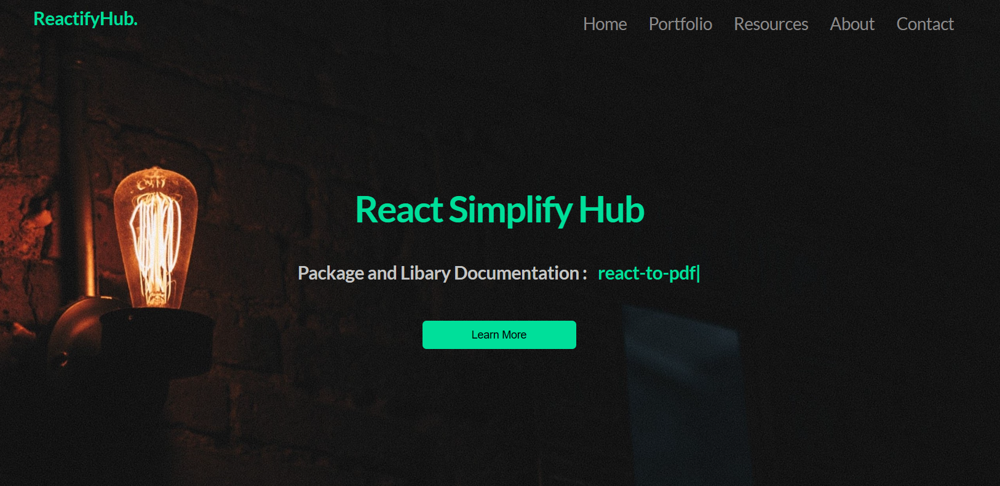
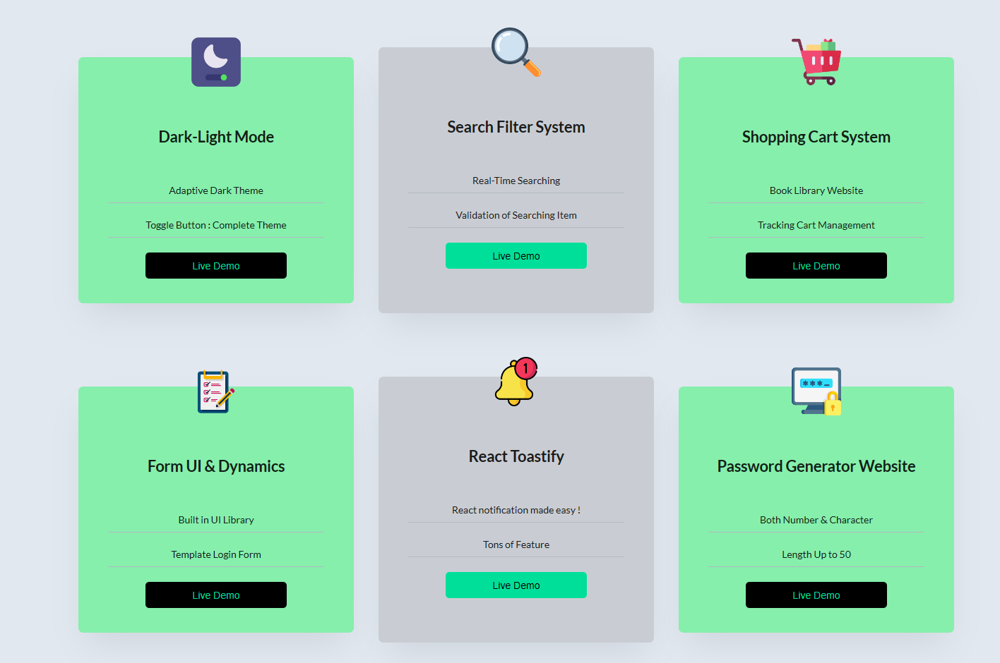
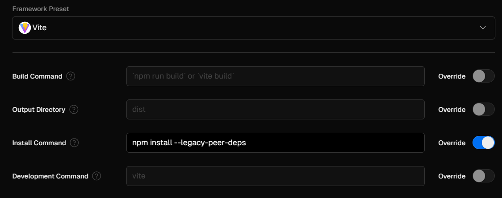

<div align = "center">

# 🙄 React Simplify Templates  🙄
###  ✌️ Your go-to for streamlining React setups with library integration and Tailwind CSS. ✌️

### [**(✍️ Read My Documentation of Learning ReactJS & TailwindCSS )**](https://sumontas-organization.gitbook.io/react-js-learning/)

### [**( 👉 Visit Offical Website : ReactifyHub ) 👈**](https://react-js-simplify-template.vercel.app/)  

<hr>


<hr>






<hr>


# React + Vite Setup

</div>

```
    npm create vite@latest
```
```
    "dependencies": {
       "@ant-design/icons": "^4.8.0",
    "@material-ui/core": "^4.12.4",
    "@mui/icons-material": "^5.14.16",
    "@mui/material": "^5.14.17",
    "@mui/styled-engine-sc": "^6.0.0-alpha.5",
    "@mui/x-data-grid": "^6.18.1",
    "@testing-library/jest-dom": "^5.17.0",
    "@testing-library/react": "^13.4.0",
    "@testing-library/user-event": "^13.5.0",
    "antd": "^5.1.2",
    "axios": "^1.5.0",
    "bootstrap": "^5.3.1",
    "jspdf": "^2.5.1",
    "keep-react": "^1.0.1",
    "moment": "^2.29.4",
    "phosphor-react": "^1.4.1",
    "react": "^18.0.0",
    "react-circular-progressbar": "^2.1.0",
    "react-datepicker": "^4.18.0",
    "react-dom": "^18.2.0",
    "react-hook-form": "^7.49.2",
    "react-icons": "^4.3.1",
    "react-particles": "^2.12.2",
    "react-router-dom": "^6.15.0",
    "react-scripts": "5.0.1",
    "react-select": "^5.8.0",
    "react-switch": "^7.0.0",
    "react-to-pdf": "^1.0.1",
    "react-to-print": "^2.14.15",
    "react-toastify": "^9.1.3",
    "react-typed": "^1.2.0",
    "semantic-ui-css": "^2.5.0",
    "semantic-ui-react": "^2.1.5",
    "styled-components": "^6.1.1",
    "swiper": "^8.4.5",
    "tsparticles-slim": "^2.12.0"
  },
```
```
    npm install
```
```
    npm run dev
```

<div align = "center">

## Tailwind CSS Setup ( [Resource Link](https://tailwindcss.com/docs/guides/vite#react) )

</div>
  

```
    npm install -D tailwindcss postcss autoprefixer
```
```
    npx tailwindcss init -p
```


  

##### Paste it in tailwind.config.js

```
/** @type {import('tailwindcss').Config} */
export default {
  content: [
    "./index.html",
    "./src/**/*.{js,ts,jsx,tsx}",
  ],
  theme: {
    extend: {},
  },
  plugins: [],
}

```


##### Paste it into Root Css


```
@tailwind base;
@tailwind components;
@tailwind utilities;
```


##### Hosting on Vercel


```
npm run build

npm install --legacy-peer-deps
```


